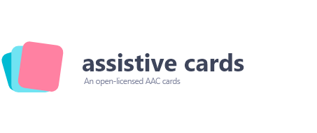
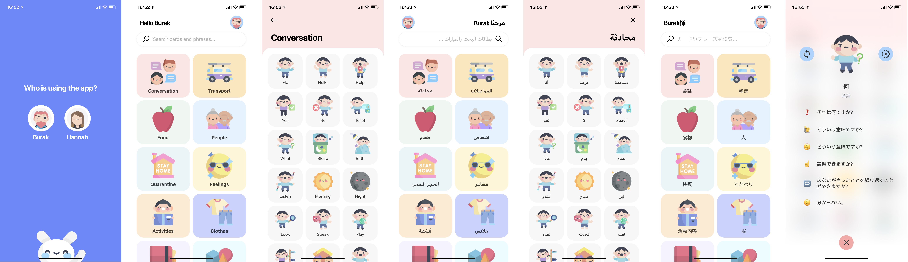

(WIP) Assistive Cards project is an Open-Licensed repository of multilingual (supporting 37 languages), icon associated phrase cards. These cards fulfill the need for modern Augmentative Alternative Communication illustrated cards, and its completely free to use for any commercial projects under *MIT License*.

Developers and designers can use this wide variety of cards to make assistive software for people with mental development issues and speaking disabilities.

## why

Most mentioned type of mobile apps have legacy illustrations, and most of them doesn't make sense for even atypical people. Supplying the community a fully integrative and editable multilingual phrase associated illustration will give this sort of apps a modern look, and encourage developers to make these applications multilingual.

## use

We are currently building an app called Leeloo AAC using this card. Leeloo is a rethink of the current AAC solutions for iOS and Android phones and tablets. Leeloo AAC uses Text-to-Speech and uses a beta version of Assistive Cards, and will allow the app to be used in 37 different languages.

## need

Translations for Assistive Cards; needs to be constantly be up-to-date since the project will be an ever growing repository. Native translators and proofreading services for 37 different language cost alot.

CDN and API server; scaling with the usage of the image CDN (PNG and SVG) and/or the API server that delivers translations and search inside the database of Assistive Cards.

Constant design updates; using the Leeloo app, we can notice by the data we collect, which assistive cards work good, and which doesn't. The constant need for an illustrator and their time.

Development costs; delivering the best developer experience for integrating free Assistive Cards API and making it run smoothly needs a fullstack developer and their time.

[Would you like to help? You can sponsor us!](mailto:info@dreamoriented.org)

## contributors

&middot; Hannah Milan ([@humbleuidesigns](https://twitter.com/humbleuidesigns)) 
&middot; Burak Tokak ([@btk](https://github.com/btk))

## links

&middot; Website ([assistivecards.com](https://assistivecards.com)) 
&middot; Twitter ([@assistivecards](https://twitter.com/assistivecards))
